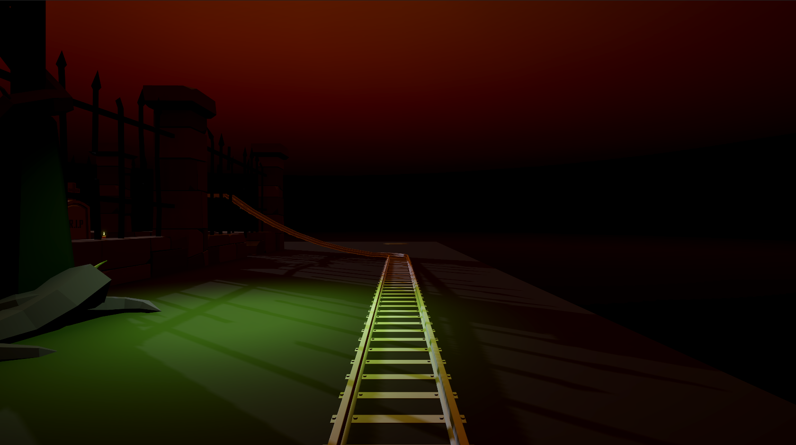
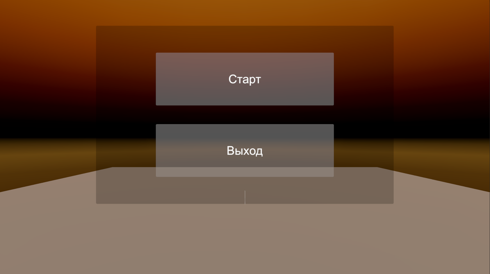
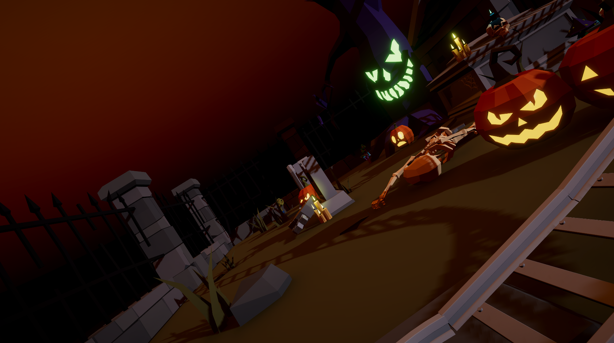
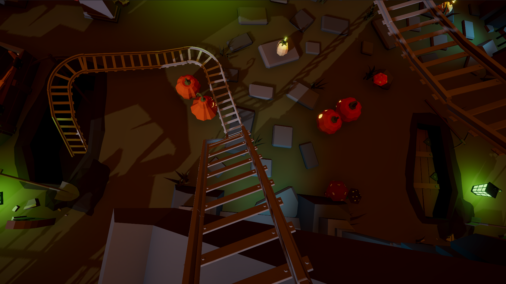
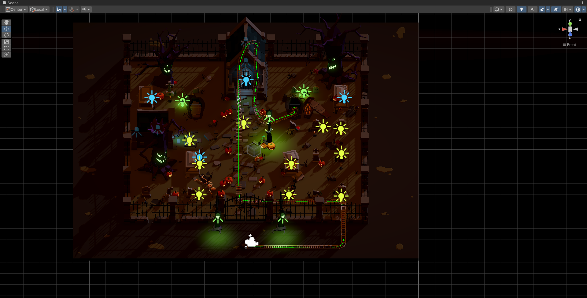

# VR Graveyard Coaster

English | [Русский](resources/localization_readme/README_RU.md)

A short VR cinematic ride built in Unity. The player sits in a minecart as a passenger — not a driver — and is carried along a fixed track through a haunted graveyard.



## Features

- **On-rails VR experience** — the cart follows a spline path; the player only looks around.
- **Speed zones** — trigger volumes along the track accelerate and slow the cart to pace the ride.
- **Motion simulator support** — optional FutuRift motion-chair output over UDP, driven by cart pitch and roll.
- **Scene flow** — a bootstrap scene loads the main menu, which launches gameplay.

## Requirements

| | |
|---|---|
| Unity | 2022.3.0f1 (URP) |
| XR | OpenXR via XR Interaction Toolkit 2.5.0 |
| Headset | Any OpenXR-compatible PC VR headset |

## Getting Started

1. Clone the repository.
2. Open `src/Roller coaster over the grave` in Unity 2022.3.0f1.
3. Connect a VR headset and confirm OpenXR is enabled under **Project Settings → XR Plug-in Management**.
4. Open `Assets/Internal assets/Scenes/Bootstrap.unity` and press **Play**.

## Scenes

| Scene | Role |
|---|---|
| `Bootstrap` | Entry point; immediately loads the main menu. |
| `MainMenu` | Start the ride or quit. |
| `Gameplay` | The graveyard coaster ride itself. |

## Project Structure

```
src/Roller coaster over the grave/
├─ Assets/
│  ├─ Internal assets/      # Project scenes and scripts
│  │  ├─ Scenes/
│  │  └─ Scripts/
│  └─ External assets/      # Third-party art and environment packs
├─ Packages/
└─ ProjectSettings/
```

## Scripts

| Script | Purpose |
|---|---|
| `Bootstrap.cs` | Loads the main menu on startup. |
| `MainMenuScreen.cs` | Main menu actions. |
| `MoveAlongWaypoints.cs` | Moves the cart along the spline path each frame. |
| `TriggerSetUpAccelerationForSpeed.cs` | Applies a speed multiplier when the cart enters a trigger. |
| `MoveToMainMenu.cs` | Returns to the main menu at the end of the ride. |
| `FutuRiftControllerManager.cs` | Streams pitch/roll to a FutuRift motion chair over UDP. |

### Motion Chair Setup

`FutuRiftControllerManager` sends to `127.0.0.1:6065` by default. To drive a chair on another machine, change the `ip` and `port` values in the script to match your controller.

## Screenshots

<details>
<summary>Main menu</summary>



</details>

<details>
<summary>Gameplay</summary>




</details>

<details>
<summary>Track map</summary>



</details>

## License

Released under the [MIT License](LICENSE.md).

Based on the original Graveyard Roller Coaster project by ShutovKS, used and redistributed under the MIT License.
